

    

# LOGIN ACCOUNT TESTING
|UserName|PassWord|
|:---:|:---:|
|TEACHER|teaching|
|STUDENTS|student123|

---
# THIS IS FINAL PROJECT PFP191 BY GROUP 3
---
## 1. INTRODUCTION

### 1.1 DESCRIPTION
- The project develops a **Student Management System** using the Python programming language.
- The program allows managing student records, entering grades and calculating GPA, searching, sorting, saving/reading data from files, while applying object-oriented programming (OOP), exception handling, and templates.

### 1.2 PROJECT TEAM 
| # | Student ID | Full Name | Completion Level | Task Performed |
| :--- | :--- | :--- | :--- | :--- |
|1|**SE203817**|**Lưu Nguyễn Tấn Khải**|100%|100%|
|2|**SE203829**|**Nguyễn Nhật Huy**|100%|100%|
|3|**SE204019**|**Nguyễn Phạm Mai Phương**|100%|100%|
|4|**SE204029**|**Lê Nam Phong**|100%|100%|

---
## 2. REQUIREMENT ANALYSIS & DECOMPOSITION

### 2.1 DATA

| # | Name | Description |
| :---: | :--- | :--- |
| **1** | **Code** | Student ID (The unique identifier for each student record). |
| **2** | **Data File** | `students.txt` (The file used for persistent storage). |
| **3** | **Data File** | `Input.csv` (The file used for load input)|

### 2.2. Functions

| # | Function | Description |
| :---: | :--- | :--- |
| **1** | **Student Management** | Manage students (Core CRUD operations and data manipulation). |

#### 2.2.1 Sub-functions of Student Management

To manage the student list effectively, the system must include the following sub-functions:

* **addStudent:** Add a new student record to the list.
* **editStudent:** Modify the information of an existing student.
* **deleteStudent:** Remove a student record from the list.
* **searchStudent:** Find students based on specific criteria (ID or Name).
* **sortStudent:** Arrange the student list based on a selected field (Name, GPA, etc.).
* **calculateGPA:** Calculate the overall average GPA of all students in the list.
* **fileIO:** Handle data persistence (reading from/writing to files).

---
## 3. ALGORITHM DESIGN & FLOWCHARTS

#### FLowChart Main.py
```mermaid
    graph TD
    A["Start: main()"] --> L{"Call authenticate_user()"};
    
    L -- "Returns None (Fails)" --> F[Exit Program];
    
    L -- "Returns Role (Success)" --> R[Save user_lg];
    R --> B("Initialize StudentManager(user_lg)");
    B --> C("Load Data: manager.Output_Load()");
    C --> D{"Main Loop: choice != 7"};

    %% Main function branches
    D -- "Yes" --> E("Display Menu and Get choice (0-7)");
    
    E --> G{"Check choice"};
    
    G -- "0: Display" --> G0("output_student_list(manager, Slist)");
    G -- "1: Add" --> G1("manager.addnew(Slist)"); 
    G -- "2: Edit" --> G2("manager.editing(Slist)");
    G -- "3: Delete" --> G3("manager.deleting(Slist)");
    G -- "4: Search" --> G4("manager.searching(Slist)");
    G -- "5: Sort" --> G5("manager.sorting(Slist)");
    G -- "6: GPA" --> G6("manager.calculate_gpa(Slist)");
    
    %% Return to loop (Quyá»n đã được kiểm tra bên trong G1-G6)
    G0,G1,G2,G3,G4,G5,G6 --> D;

    %% Program Exit
    G -- "7: Exit" --> N("Save Data: manager.Input_Load(Slist)");
    N --> O["End"];
    D -- "No" --> O;
```
---
#### FlowChart Services/Students_Manager.py

###### Function _search_for_action
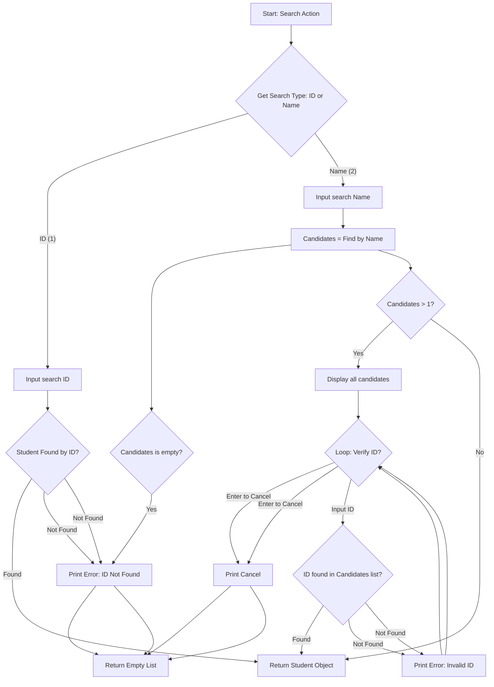
---
###### Function _do_edit_logic
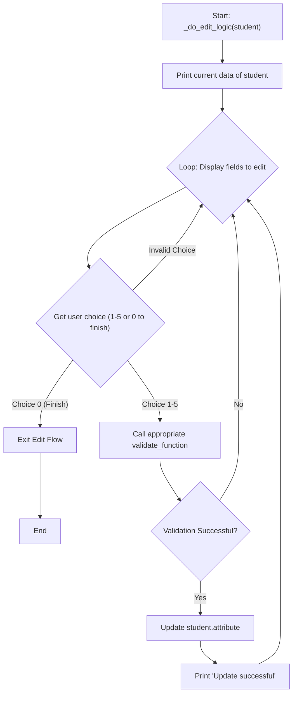
---
###### Function Addnew
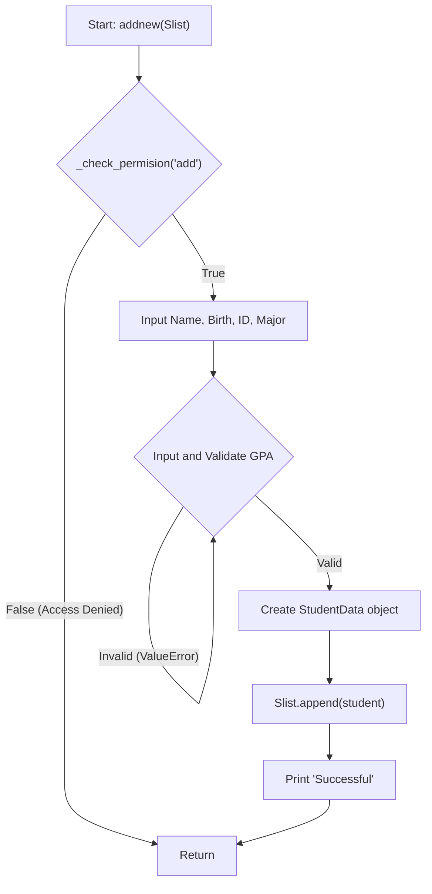
---
###### Function Editing
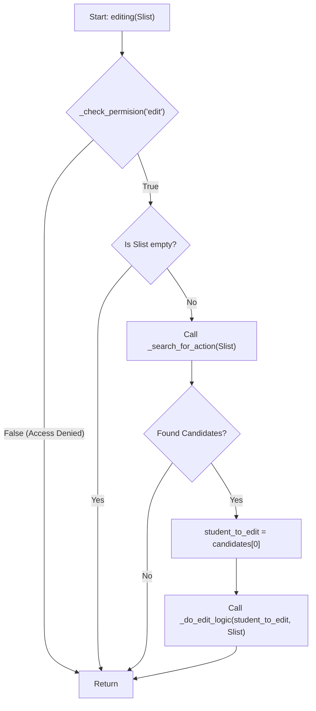
---
###### Function Deleting
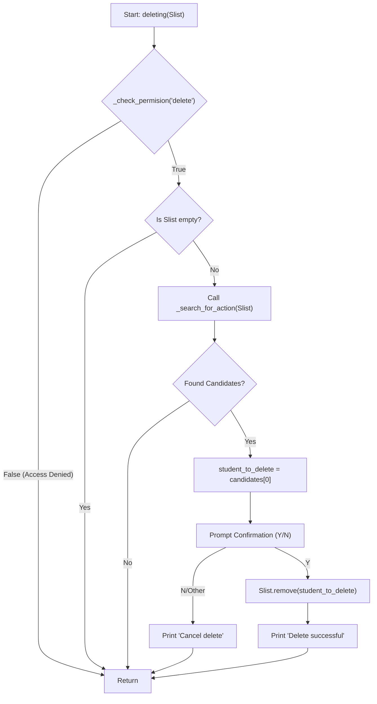
---
###### Function Searching
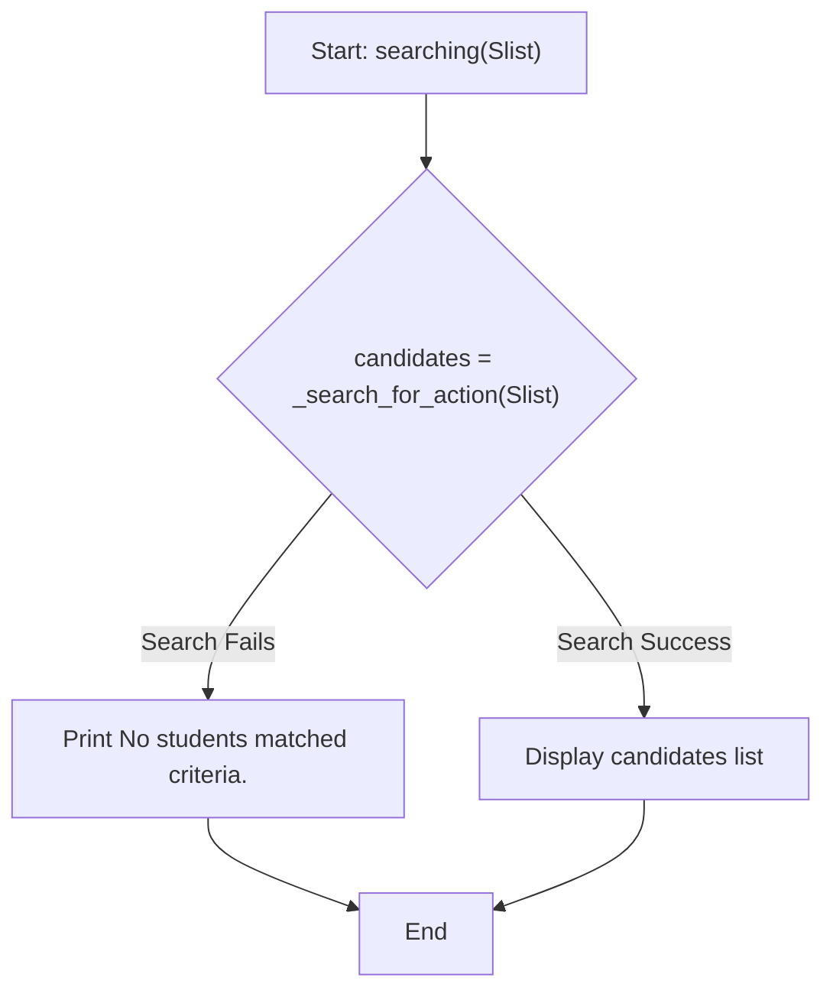
---
###### Function Sorting
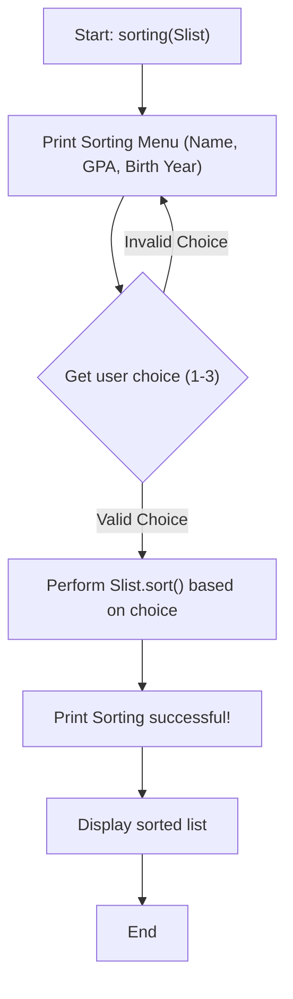
---
###### Function Calculate GPA
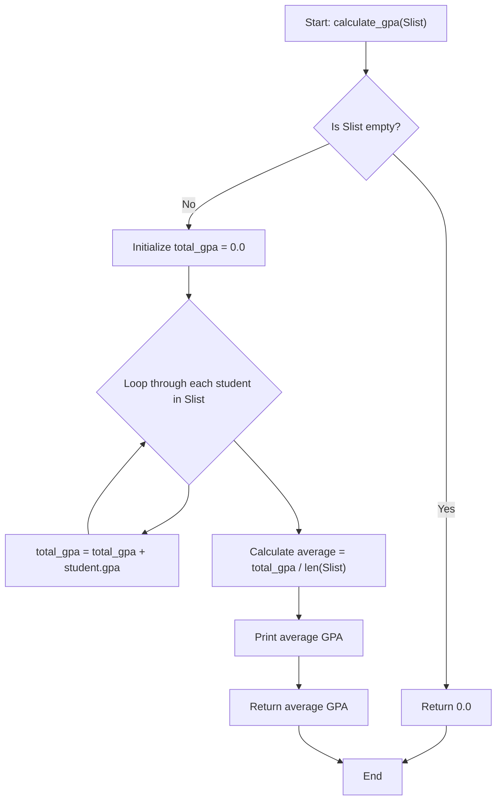
---
###### Functions Input/Output system

- <strong>INPUT</strong>
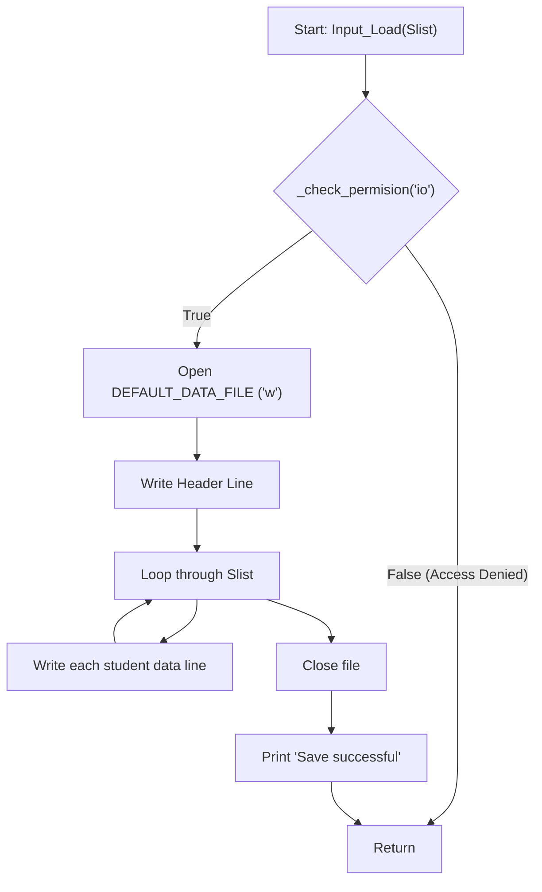
- <strong>OUTPUT</strong>
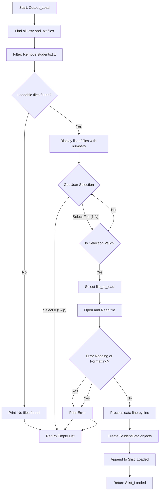
---
#### FlowChart Utils/Validation.py
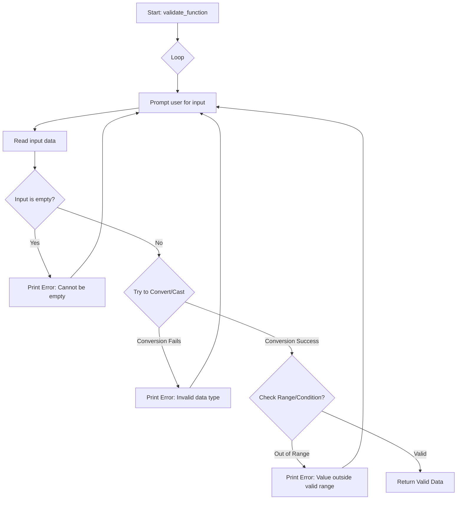
---
#### FlowChart Utils/auth.py
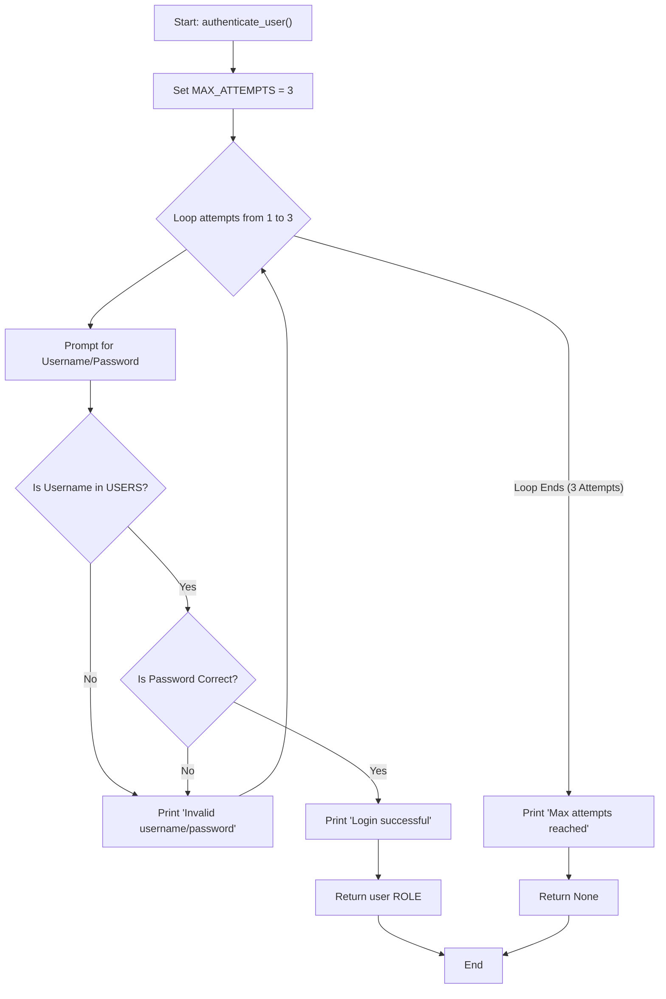
---
#### FlowChart Models/student.py
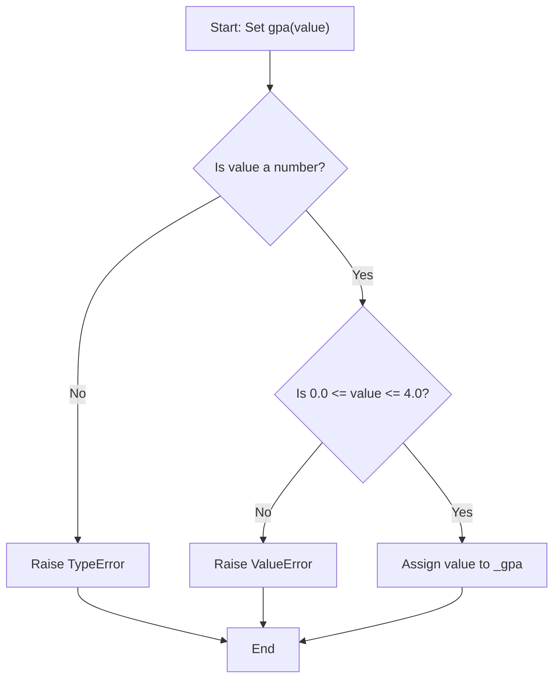
---

## 4. IMPLEMENTATION OF BASIC FUNCTIONS

### 4.1 FUNCTIONS AND STEPS  

| Function | Sub-steps |
| :--- | :--- |
| **Add Student** | **Check Permission ('add')** → Input information (Name, Birth, ID, Major, GPA) → Validate input → Create object → Save to list |
| **Calculate GPA** | Iterate list → Get each GPA → Calculate average |
| **Search by ID/Name** |Select search by ID or Name → Input search query → Iterate list → Return results |
| **Edit Information** | **Check Permission ('edit')** → Find student → Display information → Input new data → Update list |
| **Delete Student** | **Check Permission ('delete')** → Find student → Confirm deletion → Remove from list |
| **Sort List** | Select criteria (Name, GPA, Birth Year) → Sort list → Display results |
| **Write Data to File** | **Check Permission ('io')** → Open file → Write student list → Close file |
| **Read Data from File** | Open file → Read data → Create student list → Return list |
| **Display List** | Iterate through each student → Print out information |
| **Menu Navigation** | Display menu → Input selection → Call correct function |

---

### 4.2 PATTERNS (RECURRING)

## 📋 Tóm hợp Mẫu Thiết kế và Kỹ thuật

| Pattern | Description |
| :--- | :--- |
| **Object-Oriented Design (OOD)** | Use the **`StudentData`** and **`StudentManager`** classes to organize program logic and data, following the Single Responsibility Principle. |
| **Encapsulation** | Use a **Property (`@property`)** for GPA in `StudentData` to protect the internal variable (`_gpa`) and enforce validation rules. |
| **Input Validation** | Check for valid input (e.g., GPA must be from 0.0 to 4.0; menu selections must be within range) and data types. |
| **Access Control** | Use the **`_check_permision`** method within `StudentManager` to restrict functions (Add, Edit, Delete, IO) based on the user's **`role`** (TEACHER, STUDENTS). |
| **Authentication** | Use the **`authenticate_user()`** function to verify user identity (username/password) and assign a corresponding **`role`** before starting the main program. |
| **Menu Structure** | Use a **loop and integer selection (`match/case`)** to navigate the main menu, providing a clear user interface. |
| **Search by Field** | Iterate through the list to find students by **ID** or by **name** (case-insensitive substring search). |
| **File I/O** | Read and write the student list to/from the **`students.txt`** file, ensuring data persistence. |
| **Exception Handling** | Use `try...except` blocks to catch errors when converting data types, handling invalid GPA values, or dealing with **File I/O** issues. |

---

## 5. OBJECT-ORIENTED DESIGN (OOP) 
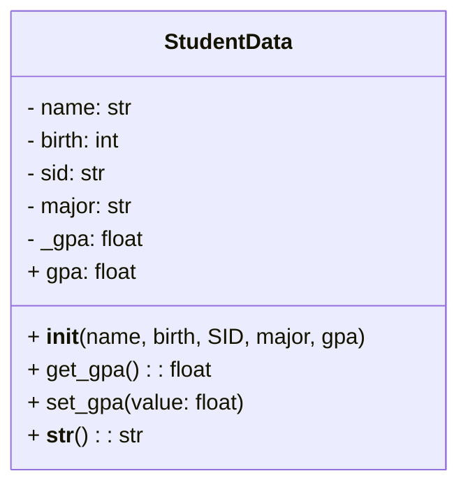

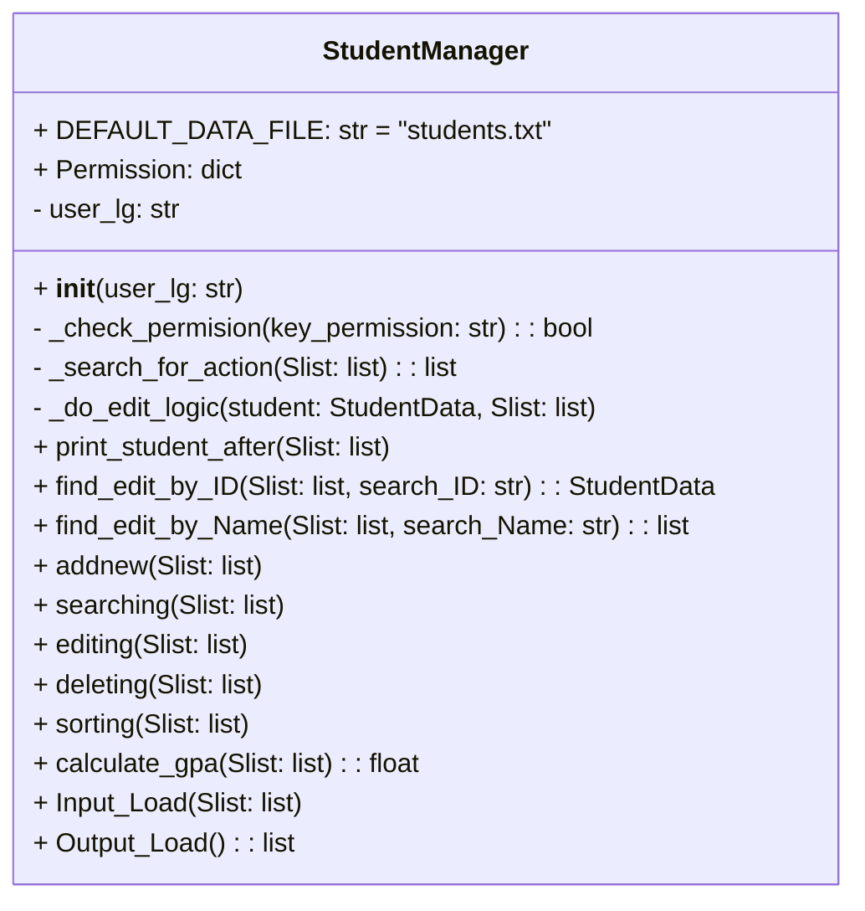
---
## 6. FILE I/O & TESTING 
##### 1/ Models/student.py
---
 Type | Name | Primary Role |
| :--- | :--- | :--- |
| **Class** | **StudentData** | Holds the data for a single(`Name`,`Birth`,`ID`,`Major`,`GPA`) |
| **Property** | `gpa` | The getter for the GPA attribute |
| **Setter** | `gpa` | Validates GPA range (0.0 to 4.0) before assigning the value |
| **Method** | `__init__` | Initializes the student attributes(`__name`, `__birth`, `__SID`, `__major`, `__gpa`) |
| **Method** | `__str__` | Formats data for display |
---
##### 2/ Services/student_manager.py

| Type | Name | Function Description |
| :--- | :--- | :--- |
| **Class** | **StudentManager** | The main management class, handling all student list operations and **user permission checks**. |
| **Variable** | `DEFAULT_DATA_FILE` | Constant specifying the data file name (`students.txt`). |
| **Variable** | `Permission` | **Class-level dictionary defining access rights** for each user role (e.g., 'TEACHER', 'STUDENTS'). |
| **Attribute** | `user_lg` | Instance attribute storing the **role of the currently logged-in user**. |
| **Method** | `__init__(user_lg)` | **Constructor** that initializes the manager instance with the **logged-in user's role**. |
| **Method** | `_check_permision(key_permission)` | **Core permission check.** Returns `True` if `user_lg` has the requested right (`key_permission`), otherwise prints "Access Denied" and returns `False`. |
| **Method** | `calculate_gpa(Slist)` | Calculates the average GPA of all students in `Slist`. |
| **Method** | `find_edit_by_ID(Slist, search_ID)` | Finds a student by ID (case-insensitive). |
| **Method** | `find_edit_by_Name(Slist, search_Name)` | Searches for students by name (substring search). |
| **Method** | `_search_for_action(Slist)` | Core logic to ask the user to search by ID or Name, used internally for Edit/Delete/Search. |
| **Method** | `_do_edit_logic(student, Slist)` | Core handler for editing and updating individual student fields. |
| **Method** | `addnew(Slist)` | **(Permission Checked)** Adds a new student object to `Slist`. |
| **Method** | `searching(Slist)` | Performs the search and displays results. |
| **Method** | `editing(Slist)` | **(Permission Checked)** Finds and edits a student's information. |
| **Method** | `deleting(Slist)` | **(Permission Checked)** Finds, confirms, and deletes a student from `Slist`. |
| **Method** | `sorting(Slist)` | Sorts `Slist` by Name, GPA, or Birth Year. |
| **Method** | `print_student_after(Slist)` | Displays the student list after sorting. |
| **Method** | `Input_Load(Slist)` | **(Permission Checked / Save Data)** Saves the current `Slist` to the `.txt` file. |
| **Method** | `Output_Load()` | **(Load Data)** Loads data from the `.txt` file and returns the `Slist`. |
---
##### 3/ Utils

###### /validation.py

| Type | Name | Function Description |
| :--- | :--- | :--- |
| **Function** | `select_menu_choice()` | Gets the integer choice from the user for the main menu (0 to 7). |
| **Function** | `get_number_choice()` | Gets the integer choice for search/edit options (1: ID, 2: Name). |

###### /auth.py

| Type | Name | Function Description |
| :--- | :--- | :--- |
| **Function** | `authenticate_user()` | Handles the **login process** with a limit of 3 attempts. It checks the input username and password against the internal `USERS` dictionary. Returns the validated **user role** (e.g., 'TEACHER', 'STUDENTS') on success, or `None` on failure. |
---
##### 4/ main.py (Execution)

| Type | Name | Function Description |
| :--- | :--- | :--- |
| **Function** | `main()` | The main function that **starts the program by calling `authenticate_user()`**, initializes the `StudentManager` with the user's role, loads data, and contains the core menu loop, calling appropriate service methods. |
| **Function** | `output_student_list(manager, Slist)` | Displays the entire **`Slist`**, and conditionally displays the **overall average GPA** by calling `manager.calculate_gpa()`. |
| **Variable** | `user_lg` | Variable storing the **validated role** of the logged-in user (e.g., 'TEACHER', 'STUDENTS') returned by `authenticate_user()`. |
| **Variable** | `manager` | The instance of the **`StudentManager`** class, initialized with `user_lg`. |
| **Variable** | `Slist` | The main list holding the **`StudentData`** objects, loaded from the file at startup. |
---

## 7. EXPERIMENTAL RESULTS

##### Menu program run

##### Add new student

##### GPA calculate

##### Editing and Deleting student

##### Sorting result

##### I/O file

---

## 8. APPENDIX

|#|Code File|
|:---|:---|
|1|`main.py`|
|2|`/models/student.py`|
|3|`/services/student_manager.py`|
|4|`/utils/validation.py`|
|5|`/utils/auth.py`|

|#|Test Case File|
|:---|:---|
|1|`students.txt`|
|2|`Input.csv`|

    

