<div align="center">
    
</div>

# LOGIN ACCOUNT TESTING
|UserName|PassWord|
|:---:|:---:|
|ADMIN|admin123|
|TEACHER|teacher123|
|STUDENTS|student123|

---
# THIS IS FINAL PROJECT PFP191 BY GROUP 3
---
## 1. INTRODUCTION

### 1.1 DESCRIPTION
- The project develops a **Student Management System** using the Python programming language.
- The program allows managing student records, entering grades and calculating GPA, searching, sorting, saving/reading data from files, while applying object-oriented programming (OOP), exception handling, and templates.

### 1.2 PROJECT TEAM 
| # | Student ID | Full Name | Completion Level | Task Performed |
| :--- | :--- | :--- | :--- | :--- |
|1|**SE203817**|**Lưu Nguyễn Tấn Khải**|100%|100%|
|2|**SE204019**|**Nguyễn Phạm Mai Phương**|100%|100%|
|3|**SE204029**|**Lê Nam Phong**|100%|100%|

---
## 2. REQUIREMENT ANALYSIS & DECOMPOSITION

### 2.1 DATA

| # | Name | Description |
| :---: | :--- | :--- |
| **1** | **Code** | Student ID (The unique identifier for each student record). |
| **2** | **Data File** | `students.csv` (The file used for persistent storage). |
| **3** | **Data File** | User-specified file (e.g., `data.csv`) (The file used for load input). |

### 2.2. Functions

#### 2.2.1 Business Logic Services (`/services`)

| # | Function | Description |
| :---: | :--- | :--- |
| **1** | **Manager Facade** | Orchestrates tasks by calling other services (`student_manager.py`). |
| **2** | **Adding Service** | Handles the logic for adding a new student (`adding.py`). |
| **3** | **Calculating Service**| Handles GPA calculations and statistics (`calculating.py`). |
| **4** | **Deleting Service** | Handles the logic for deleting a student (`deleting.py`). |
| **5** | **Editing Service** | Handles the logic for modifying a student (`editing.py`). |
| **6** | **I/O Service** | Manages saving to and loading from files (`IO_services.py`). |
| **7** | **Searching Service**| Handles all logic for finding students (`searching.py`). |
| **8** | **Sorting Service** | Handles all logic for sorting the student list (`sorting.py`). |

#### 2.2.2 Data Models (`/models`)

| # | Function | Description |
| :---: | :--- | :--- |
| **1** | **Student Model** | Defines the data structure for a student record. |
| **2** | **User Model** | Defines the data structure for a user account. |
| **3** | **Role Model** | Defines the system roles (e.g., TEACHER, STUDENTS). |

### 2.2.3 Utility Functions (`/utils`)

| # | Function | Description |
| :---: | :--- | :--- |
| **1** | **Authentication** | Handles user login and session creation (`authenticate_user`). |
| **2** | **Authorization** | Checks user permissions for specific actions (`Check_permision`). |
| **3** | **Input Validation** | Validates and sanitizes user input from the console (`select_menu_choice`). |
| **4** | **Security** | Manages password hashing and verification (`hash_password`, `check_PW`). |

---
## 3. ALGORITHM DESIGN & FLOWCHARTS
### Use-Case Diagram

<div align="center">
    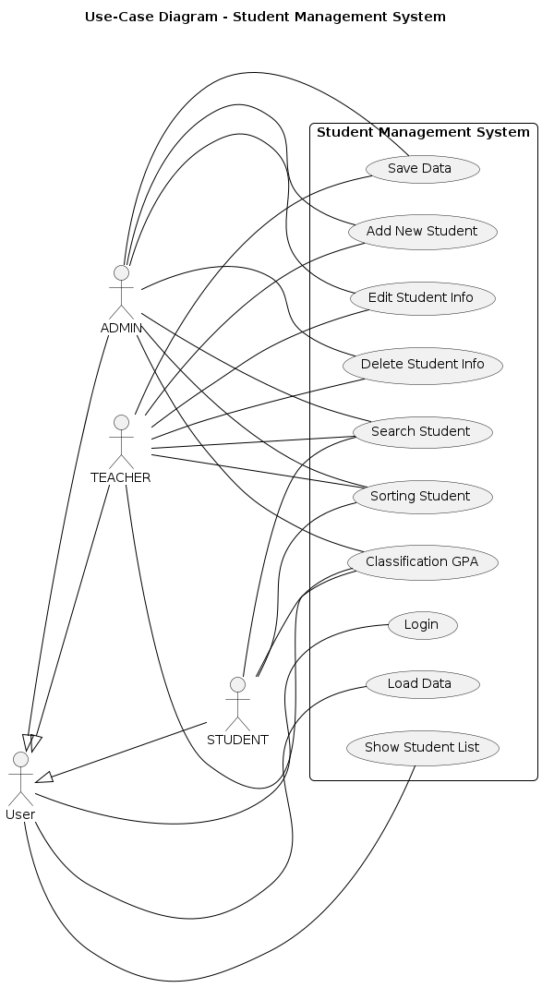
</div>

---
### Sequence Diagram
#### Login and Failed
<div align = "center">
    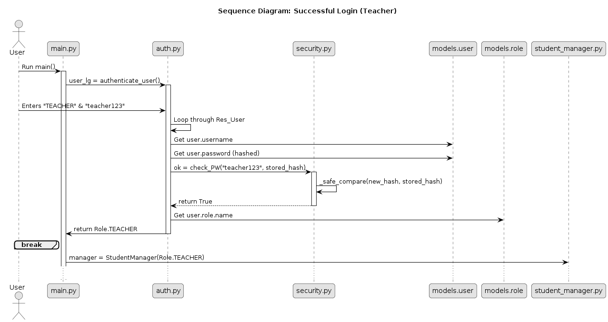
</div>

<div align = "center">
    
</div>

---
#### Function
<div align = "center" >
    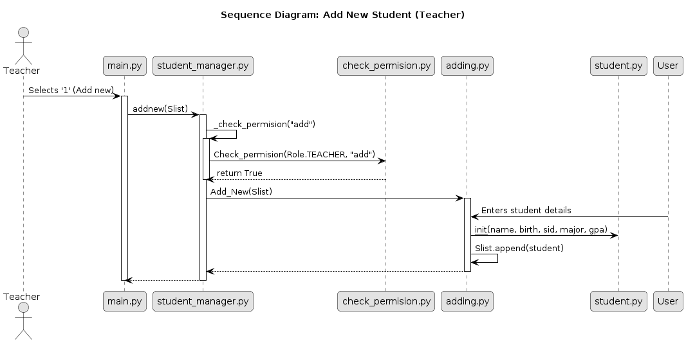
    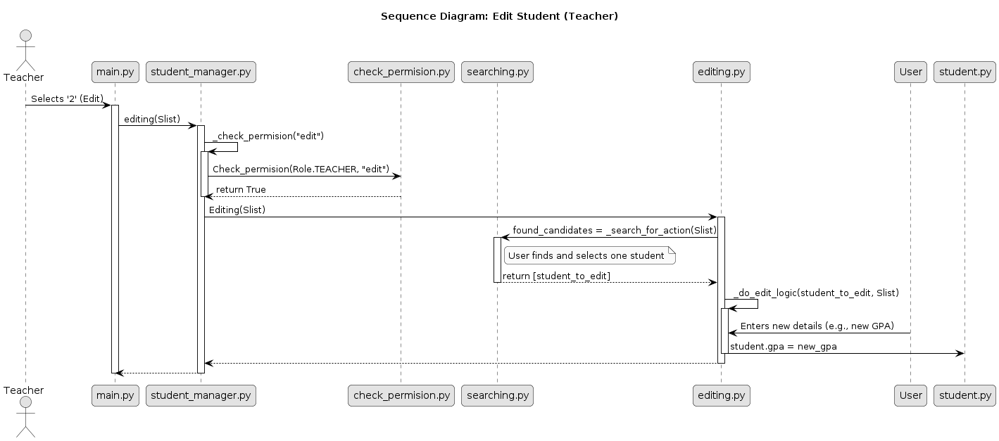
    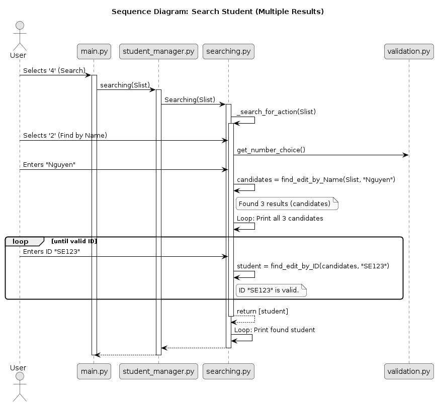
    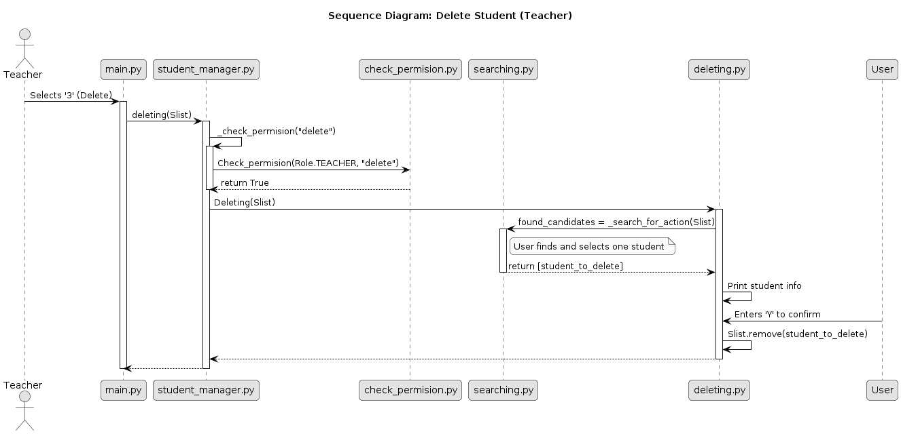
    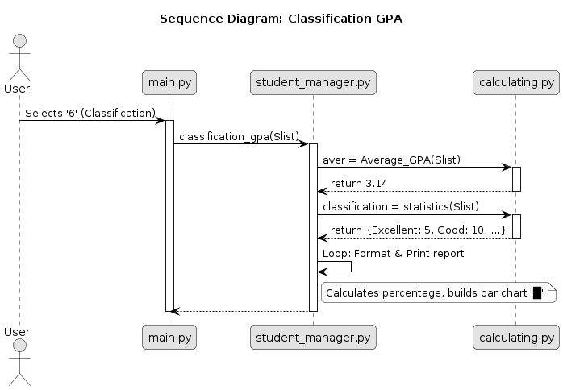
    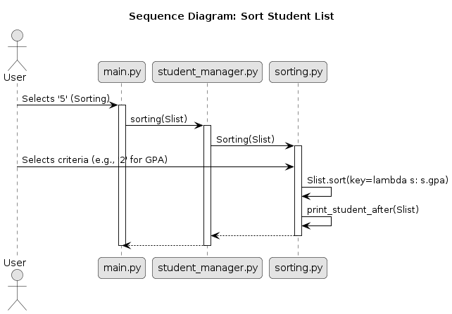
    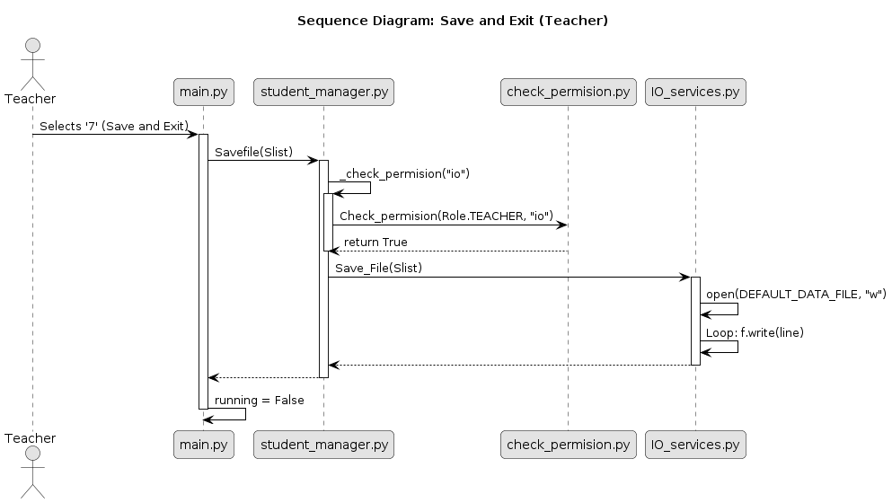
    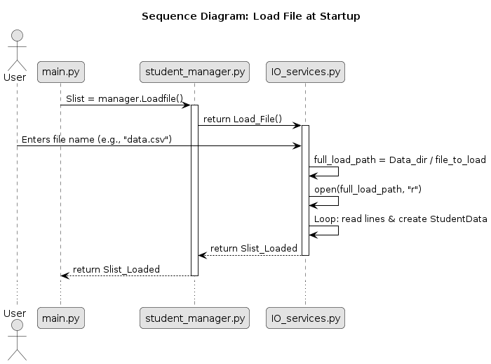
    
    
</div>

---
### Activity/State
#### (`/main.py`)
<div align="center">
    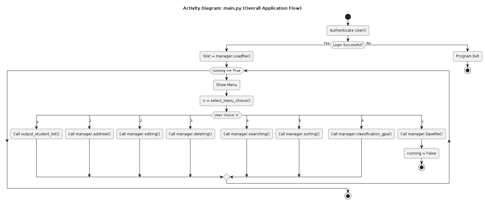
</div>

#### (`/utils/auth.py`)
<div align="center">
    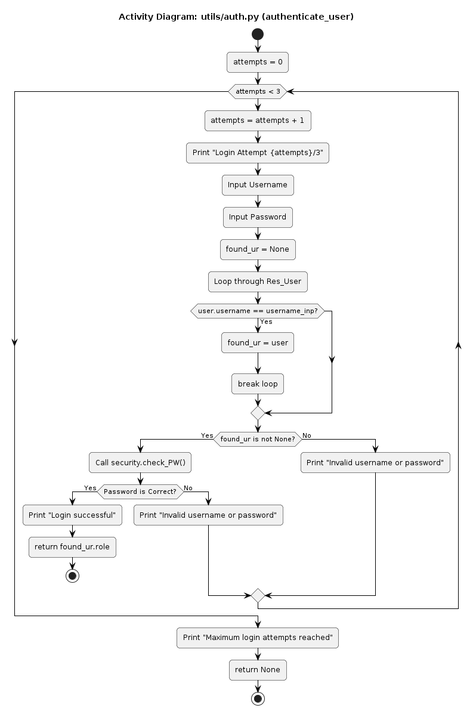
</div>

#### (`/service`)
<div align="center">
    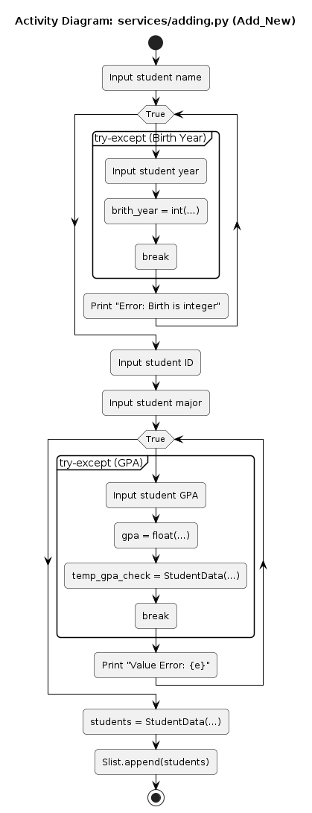
    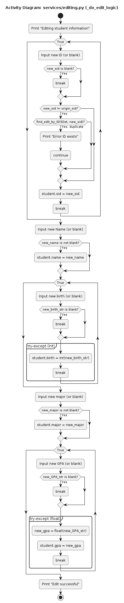
    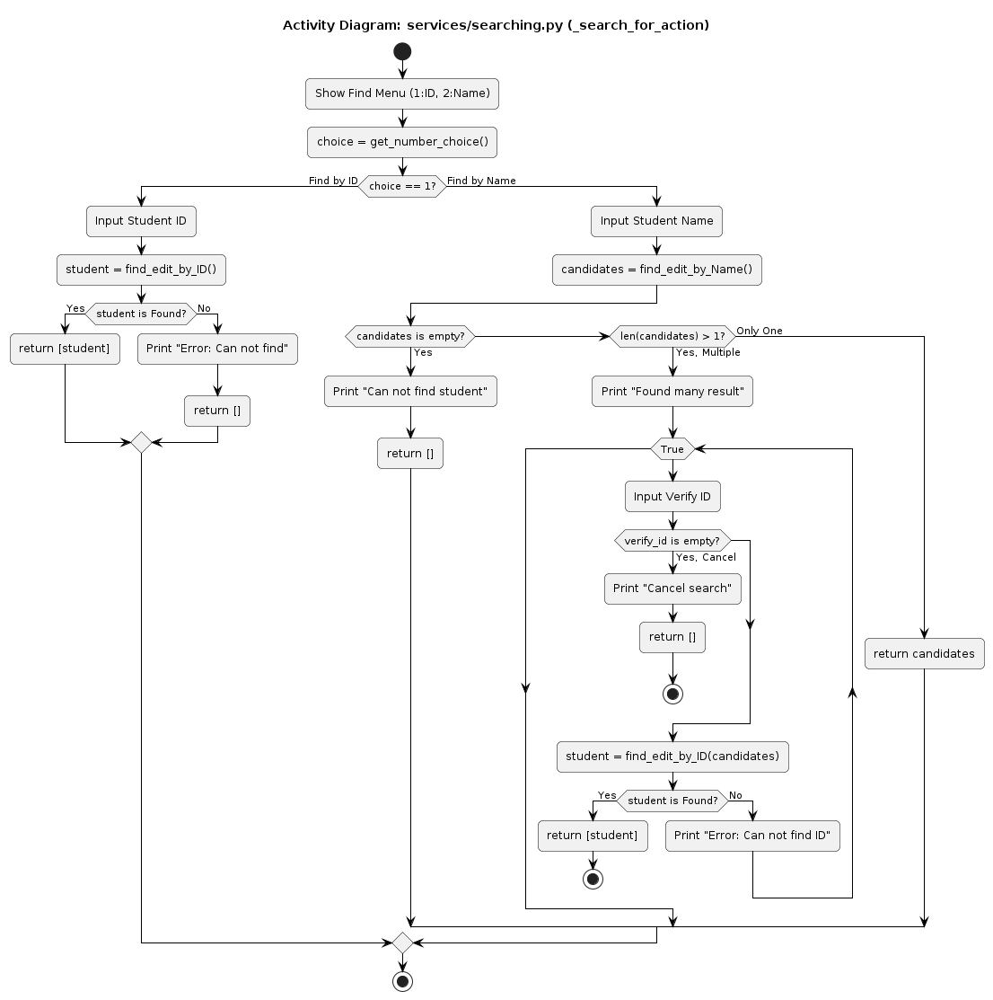
    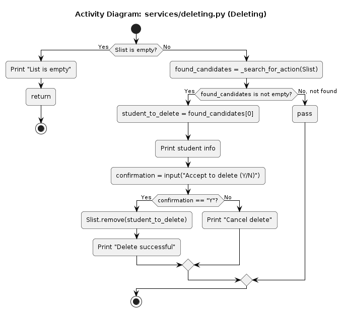
    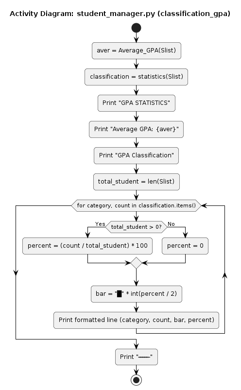
    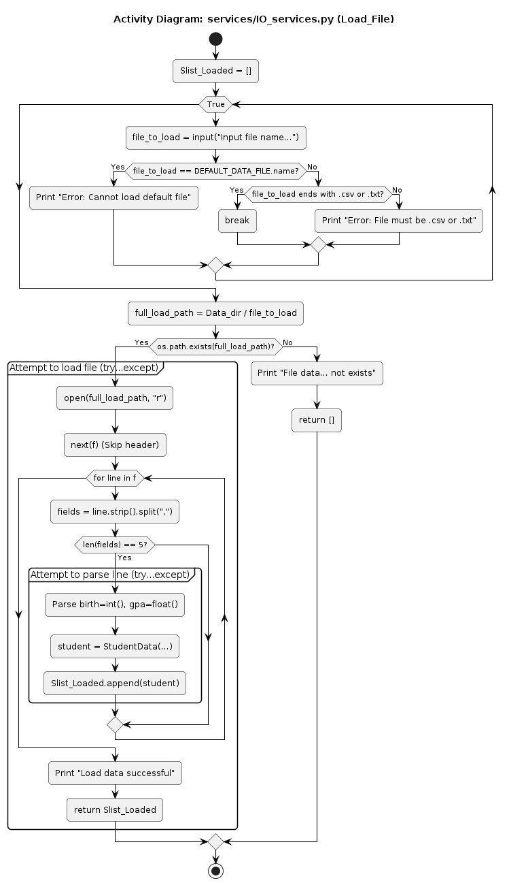
</div>

---
## 4. IMPLEMENTATION OF BASIC FUNCTIONS

### 4.1 FUNCTIONS AND STEPS

| Function | Sub-steps |
| :--- | :--- |
| **Authentication** | **(First Step)** Input Username/Password → Check hash → Return user role (`ADMIN`, `TEACHER`, `STUDENT`) |
| **Add Student** | **Check Permission ('add')** → Input information (Name, Birth, ID, Major, GPA) → Validate input → Create object → Save to list |
| **Classification GPA** | **(Upgraded)** Iterate list → Get each GPA → Calculate average **AND** Classify students (Excellent, Good, etc.) |
| **Search by ID/Name** |Select search by ID or Name → Input search query → Iterate list → Return results |
| **Edit Information** | **Check Permission ('edit')** → Find student → Display information → Input new data → Update list |
| **Delete Student** | **Check Permission ('delete')** → Find student → Confirm deletion → Remove from list |
| **Sort List** | Select criteria (Name, GPA, Birth Year) → Sort list → Display results |
| **Write Data to File** | **Check Permission ('io')** → Open file (absolute path) → Write student list → Close file |
| **Read Data from File** | Open file (from `data/` folder) → Read data → Create student list → Return list |
| **Display List** | Iterate through each student → Print out information |
| **Menu Navigation** | Display menu → Input selection → Call correct function |

---

### 4.2 PATTERNS (RECURRING)

| Pattern | Description |
| :--- | :--- |
| **Object-Oriented Design (OOD)** | Use **`StudentData`**, **`User`**, and **`Role`** classes to model data. |
| **Facade & Service Layer** | **(New)** Use **`StudentManager`** as a **Facade**. Business logic is decentralized into a **Service Layer** (e.g., `adding.py`, `calculating.py`) following the Single Responsibility Principle. |
| **Encapsulation** | Use a **Property (`@property`)** for GPA in `StudentData` to protect the internal variable (`_gpa`) and enforce validation rules. |
| **Input Validation** | Check for valid input (e.g., GPA 0.0-4.0; menu selections) and data types (`try-except int/float`). |
| **Access Control** | Use `Check_permision` to restrict functions based on the user's **`role`** (`ADMIN`, `TEACHER`, `STUDENT`). |
| **Authentication** | Use `authenticate_user()` to verify user identity before starting the main program. |
| **Password Hashing** | **(New)** Use `hashlib.pbkdf2_hmac` (`security.py`) to **hash** passwords. Use `_safe_compare` to prevent timing attacks. |
| **Menu Structure** | Use a **loop and integer selection (`match/case`)** to navigate the main menu. |
| **Search by Field** | Iterate through the list to find students by **ID** or by **name** (case-insensitive substring search). |
| **File I/O** | Read and write the student list to/from the **`students.csv`** file, ensuring data persistence. |
| **Absolute Path Management** | **(New)** Use **`pathlib`** to manage absolute file paths and ensure the `data/` directory exists. |
| **Exception Handling** | Use `try...except` blocks to catch errors when converting data types, handling invalid GPA values, or dealing with **File I/O** issues. |

---

## 5. OBJECT-ORIENTED DESIGN (OOP) 
### Class Diagram
#### (`/models`)
##### Role
<div align = "center"> 
    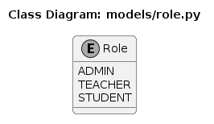 
</div>

##### Student
<div align = "center">
    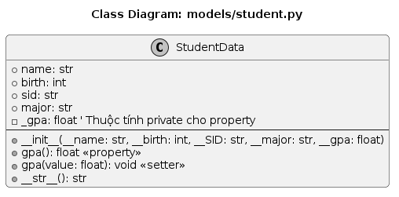
</div>

##### User
<div align = "center">
    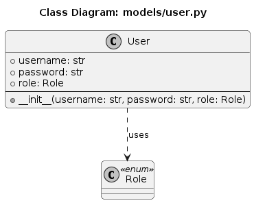
</div>

---
#### (`/services`)
##### Student_manager
<div align="center">
    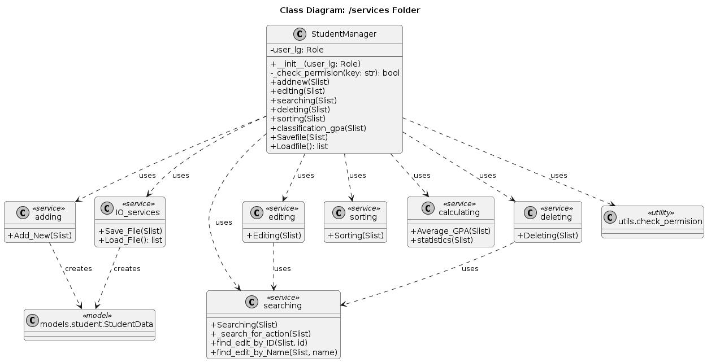
</div>

---
## 6. FILE I/O & TESTING

### 1/ Models

##### /models/student.py

| Type | Name | Primary Role |
| :--- | :--- | :--- |
| **Class** | **StudentData** | Holds the data for a single student (`Name`,`Birth`,`ID`,`Major`,`GPA`). |
| **Property** | `gpa` | The getter for the GPA attribute. |
| **Setter** | `gpa` | Validates GPA range (0.0 to 4.0) before assigning the value. |
| **Method** | `__init__` | Initializes the student attributes. |
| **Method** | `__str__` | Formats data for display. |

##### /models/user.py

| Type | Name | Primary Role |
| :--- | :--- | :--- |
| **Class** | **User** | Holds the data for a single user account (`username`, `password`, `role`). |
| **Method** | `__init__` | Initializes the user attributes. |

##### /models/role.py

| Type | Name | Primary Role |
| :--- | :--- | :--- |
| **Enum** | **Role** | Defines the constant roles as strings: `ADMIN`, `TEACHER`, `STUDENT`. |

---
### 2/ Services (The Business Logic Layer)

##### /services/student_manager.py (Facade)

| Type | Name | Function Description |
| :--- | :--- | :--- |
| **Class** | **StudentManager** | Acts as a **Facade**. It handles permission checks and **delegates** all logic to other service files. |
| **Attribute** | `user_lg` | Instance attribute storing the **Role object** of the logged-in user. |
| **Method** | `__init__(user_lg)` | **Constructor** that initializes the manager with the user's Role. |
| **Method** | `_check_permision(key)` | **Wrapper** that calls the main `Check_permision` function from `utils`. |
| **Method** | `addnew(Slist)` | **(Permission Checked)** Calls `adding.Add_New`. |
| **Method** | `editing(Slist)` | **(Permission Checked)** Calls `editing.Editing`. |
| **Method** | `searching(Slist)` | Calls `searching.Searching`. |
| **Method** | `deleting(Slist)` | **(Permission Checked)** Calls `deleting.Deleting`. |
| **Method** | `sorting(Slist)` | Calls `sorting.Sorting`. |
| **Method** | `classification_gpa(Slist)` | **(Statistics Display)** Gets data from `calculating.py`, then calculates percentages and prints the bar chart. |
| **Method** | `Savefile(Slist)` | **(Permission Checked)** Calls `IO_services.Save_File`. |
| **Method** | `Loadfile()` | Calls `IO_services.Load_File`. |

##### /services/adding.py

| Type | Name | Function Description |
| :--- | :--- | :--- |
| **Function** | `Add_New(Slist)` | Handles all logic for inputting and validating new student data, then appends to `Slist`. |

##### /services/calculating.py

| Type | Name | Function Description |
| :--- | :--- | :--- |
| **Function** | `Average_GPA(Slist)` | Calculates and rounds the average GPA of all students. |
| **Function** | `statistics(Slist)` | Counts students into categories (Excellent, Good, etc.) and returns a dictionary. |

##### /services/deleting.py

| Type | Name | Function Description |
| :--- | :--- | :--- |
| **Function** | `Deleting(Slist)` | Calls `_search_for_action` to find a student, asks for 'Y/N' confirmation, and removes from `Slist`. |

##### /services/editing.py

| Type | Name | Function Description |
| :--- | :--- | :--- |
| **Function** | `_do_edit_logic(student, Slist)` | Core handler for editing individual fields, includes validation loops. |
| **Function** | `Editing(Slist)` | Calls `_search_for_action` to find a student, then calls `_do_edit_logic` to edit it. |

##### /services/searching.py

| Type | Name | Function Description |
| :--- | :--- | :--- |
| **Function** | `find_edit_by_ID(Slist, search_ID)` | Finds a student by ID (case-insensitive). |
| **Function** | `find_edit_by_Name(Slist, search_Name)` | Searches for students by name (substring search). |
| **Function** | `_search_for_action(Slist)` | Core logic to ask user (ID or Name) and handle multiple results. |
| **Function** | `Searching(Slist)` | Main function called by the manager to find and print results. |

##### /services/sorting.py

| Type | Name | Function Description |
| :--- | :--- | :--- |
| **Function** | `print_student_after(Slist)` | Displays the student list after sorting. |
| **Function** | `Sorting(Slist)` | Asks user for criteria (Name, GPA, Birth) and sorts `Slist`. |

##### /services/IO_services.py

| Type | Name | Function Description |
| :--- | :--- | :--- |
| **Variable** | `Data_dir` | **Absolute path** to the `/data` folder, managed by `pathlib`. |
| **Variable** | `DEFAULT_DATA_FILE` | Constant specifying the data file name (`students.csv`). |
| **Function** | `Save_File(Slist)` | Saves the current `Slist` to `students.csv` using an absolute path. |
| **Function** | `Load_File()` | Loads data from a user-specified file inside the `data/` folder. |

---
### 3/ Utils

##### /utils/validation.py

| Type | Name | Function Description |
| :--- | :--- | :--- |
| **Function** | `select_menu_choice()` | Gets the integer choice from the user for the main menu (0 to 7). |
| **Function** | `get_number_choice()` | Gets the integer choice for search/edit options (1: ID, 2: Name). |

##### /utils/auth.py

| Type | Name | Function Description |
| :--- | :--- | :--- |
| **Variable** | `Res_User` | A **Set** of `User` objects (ADMIN, TEACHER, STUDENT) holding hashed passwords. |
| **Function** | `authenticate_user()` | Handles the 3-attempt login. Compares user input against the `Res_User` list by calling `security.check_PW()`. Returns a **Role object** (e.g., `Role.TEACHER`) on success. |

##### /utils/check_permision.py

| Type | Name | Function Description |
| :--- | :--- | :--- |
| **Variable** | `Permission` | **Main dictionary** defining access rights for each **Role object** (`Role.ADMIN`, `Role.TEACHER`, `Role.STUDENT`). |
| **Function** | `Check_permision(user_lg, key)` | **Core permission check.** Returns `True` if `user_lg` has the right, else `False`. |

##### /utils/security.py

| Type | Name | Function Description |
| :--- | :--- | :--- |
| **Function** | `hash_PW(Plain_Text_PW)` | Hashes a password using `hashlib.pbkdf2_hmac` with a random salt. |
| **Function** | `check_PW(Plain_Text_PW, hash)` | Securely compares a plain text password against a stored "salt:hash" string. |
| **Function** | `_safe_compare(a, b)` | A **constant-time compare** function to prevent timing attacks. |

---
### 4/ main.py (Execution)

| Type | Name | Function Description |
| :--- | :--- | :--- |
| **Function** | `main()` | The main function that **starts the program by calling `authenticate_user()`**, initializes `StudentManager`, loads data, and contains the core menu loop. |
| **Function** | `output_student_list(manager, Slist)` | Displays `Slist`, and **directly imports/calls `Average_GPA()`** from `calculating.py` to show the average GPA. |
| **Variable** | `user_lg` | Variable storing the **validated Role object** (e.g., `Role.TEACHER`) returned by `authenticate_user()`. |
| **Variable** | `manager` | The instance of the **`StudentManager`** class, initialized with `user_lg`. |
| **Variable** | `Slist` | The main list holding the **`StudentData`** objects. |
---

## 7. EXPERIMENTAL RESULTS

##### Menu program run

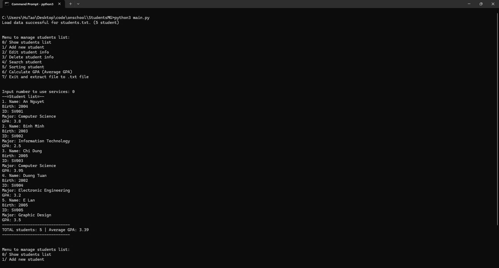

##### Add new student

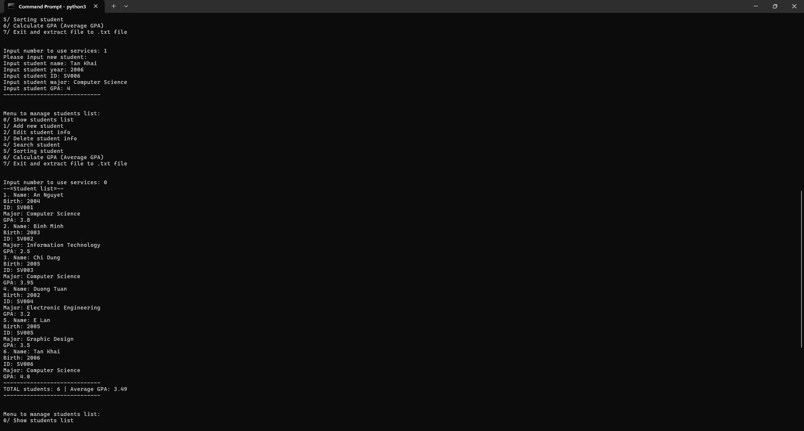

##### GPA calculate

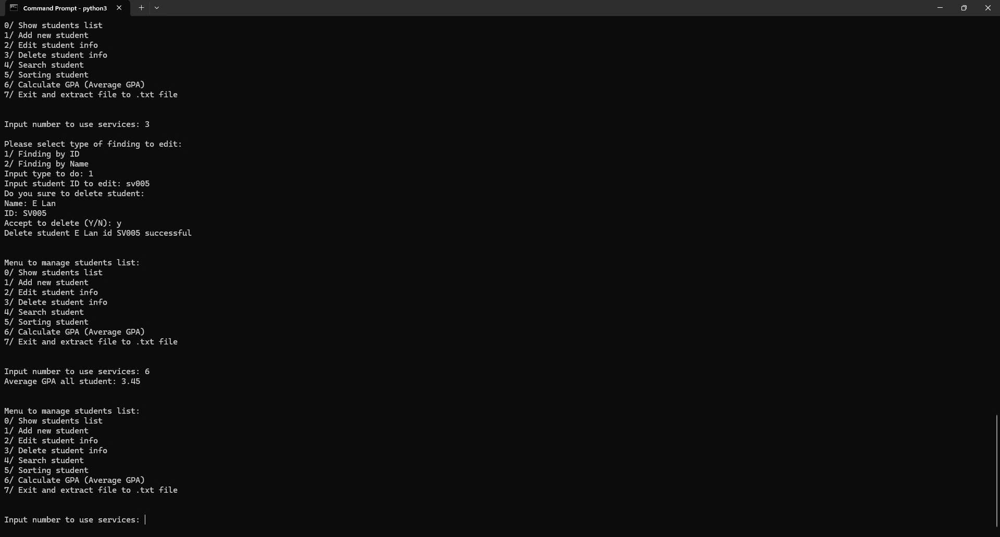

##### Editing and Deleting student

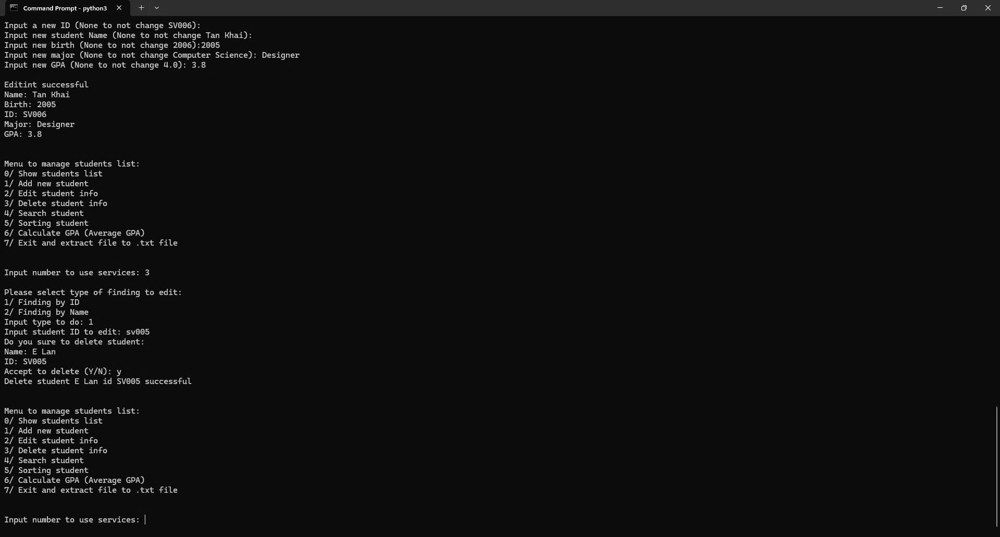

##### Sorting result

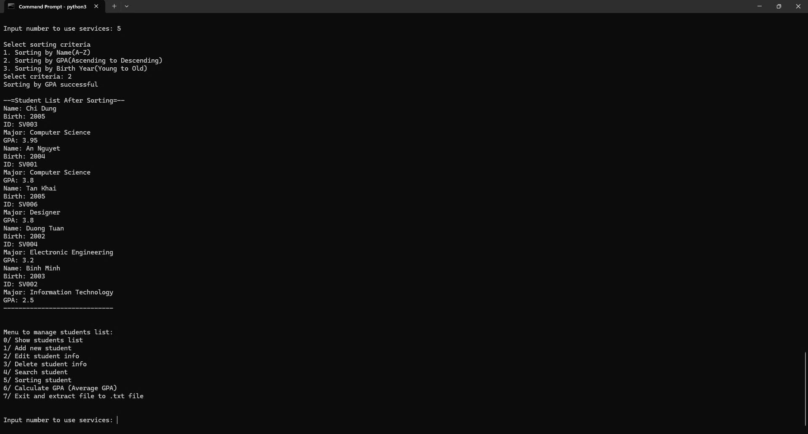

##### I/O file

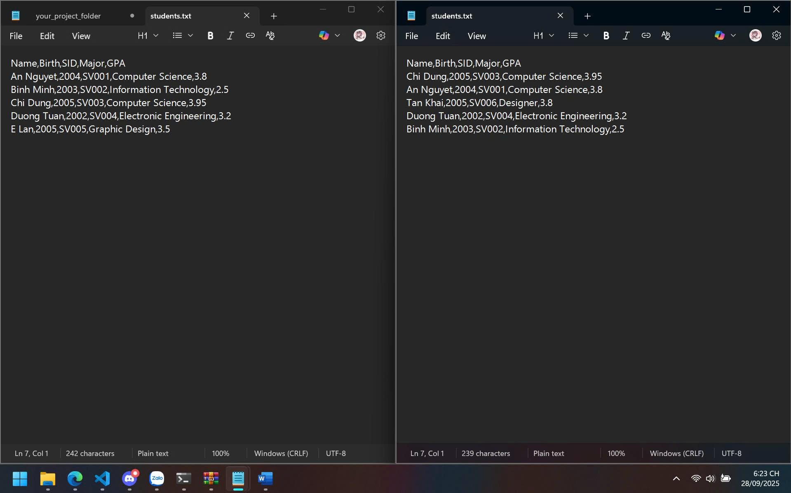

---

## 8. APPENDIX
```
C:.
│   main.py
│   README.md
│
├───data
│       Input.csv
│       students.csv
│
├───models
│       role.py
│       student.py
│       user.py
│       __init__.py
│
├───services
│       adding.py
│       calculating.py
│       deleting.py
│       editing.py
│       IO_services.py
│       searching.py
│       sorting.py
│       student_manager.py
│       __init__.py
│
└───utils
        auth.py
        check_permision.py
        security.py
        validation.py
```
<div align="center">
    
</div>